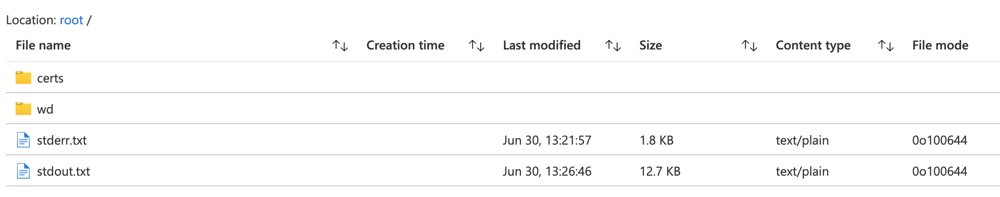

### ARM Deployment

If you are running into issues getting the infrastructure spun up through the
ARM template, there are a few options for debugging:

1. If the resource group was created, navigate to the resource group, and
then the deployments menu option.  Here you will find the list of deployments
tied to this resource group, and navigating deeper into each deployment
may show additional information for the deployment of each resource.

2. Open the [Activity Log](https://ms.portal.azure.com/#blade/Microsoft_Azure_ActivityLog/ActivityLogBlade)
for an additional source of information for recent issues within your subscription.

### Batch Tasks

If you are running into issues getting your batch task to run successfully,
the best place to get information to help debug the problem is within the
`stdout` and `stderr` of the batch task itself.  This can be accessed by navigating
to your batch account in the portal, and then to the specific job and task
that ran.  Once there, you will be able to access `stdout.txt` and `stderr.txt`:

### Common Issues

1. Quota issues.  If quota increases haven't been requested, it can be common
to run into quota issues for both the number of batch accounts as well as for
the `Standard NPS Family vCPUs`.  Please make sure you have available
[quota](#deployment-steps) before deploying the ARM template.

2. Input file streaming.  Currently, DRAGEN does not support input streaming
from public Blob containers.  Input files from private Blob containers can be
streamed provided that the proper storage credentials are passed to the batch
command.
