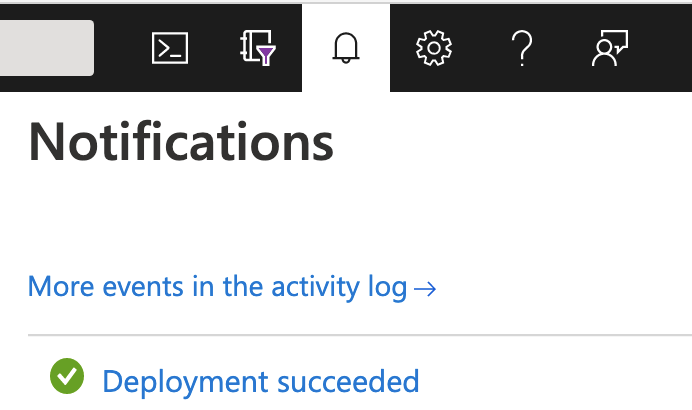

### Login to your Azure Portal account

1. Log in to your Azure account in the [Azure Portal](https://portal.azure.com).
1. Ensure you have Quota for NP-series Virtual Machines, as outlined in the
   pre-requisites section above, by navigating to:

   * Subscriptions -> Choose your subscription
   * Click **Usages + quotas** from the left-side menu
   * Filter the list by typing **NP** into the left search bar.
        * You should see `Standard NPS Family vCPUs`, and a denomination. If you see
          `0 of 0`, click the edit icon to request quota.

### Deploy the Quickstart (solution template)

1. While signed in to your Azure account, open the page for the DRAGEN Solution:
   1. Navigate to the [Marketplace](https://ms.portal.azure.com/#blade/Microsoft_Azure_Marketplace/GalleryMenuBlade/selectedMenuItemId/home)
   1. Search for "DRAGEN" and select DRAGEN on Azure Batch
1. Review the terms and conditions, and then choose **Accept Terms**
1. You'll be prompted to select a resource group, and other particulars of the
   solution to deploy. Once you've made your selections, click **Review + Create**
   at the bottom of the screen
1. You can check deployment status in the top right of the Azure Portal page.
   
